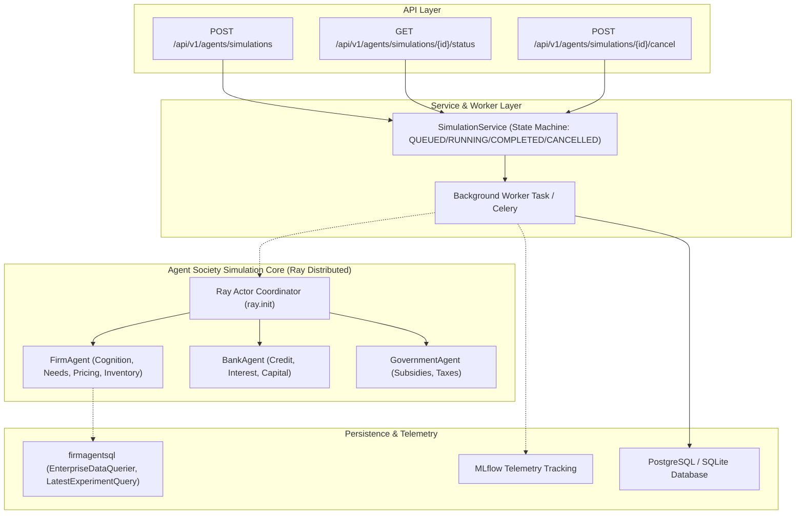

# SupplyChainAgent: Agent & Simulation Integration Status

**Document Version:** 1.0.0  
**Phase:** Phase 5 — Production Integration & Hardening  
**Status:** Canonical Multi-Agent Subsystem Audit  

---

## 1. Multi-Agent Ecosystem Architecture

The SupplyChainAgent platform incorporates a multi-agent economic simulation architecture originally designed in `agentsociety/` and `SupplyChainAgent/enterprise/`.

---

## 2. Agent Catalog & Status Matrix

| Agent / Subsystem | Location | Execution Model | Inputs | Outputs / Persistence | Status | Operational Mode |
|:---|:---|:---|:---|:---|:---:|:---:|
| **FirmAgent** | `agentsociety/cityagent/firmagent.py` | Ray Distributed Actor | Company profile, production recipe, market prices, supply contracts | Transaction logs, inventory balances, financial statements (`firmagentsql`) | **B. Legacy Bridge** | Hybrid (Requires Ray runtime) |
| **BankAgent** | `agentsociety/cityagent/bankagent.py` | Ray Distributed Actor | Firm capital accounts, interest rate policies | Loan disbursements, repayment schedules | **B. Legacy Bridge** | Hybrid |
| **GovernmentAgent** | `agentsociety/cityagent/governmentagent.py` | Ray Distributed Actor | Macro-economic policy, taxation rates | Subsidies, tax collections | **B. Legacy Bridge** | Hybrid |
| **Simulation Coordinator** | `SupplyChainAgent/enterprise/main.py` | Ray `AgentSociety` Runner | `config.yaml`, experiment parameters | Run trajectory, step checkpoints | **B. Legacy Bridge** | Live when Ray initialized |
| **Simulation Task Manager** | `backend/app/services/simulation_service.py` | Async Background Worker | `SimulationDispatchRequest` (`num_days`, `num_firms`) | Task records with real-time lifecycle states & token counters | **A. Real Migrated** | Live (In-Memory + Worker) |
| **Data Querier Bridge** | `firmagentsql/select.py` (`EnterpriseDataQuerier`) | Psycopg / SQLite Queries | `experiment_id`, step/day indices | Timeline metrics, company status, dialog history | **B. Legacy Bridge** | Live (Database query) |
| **Experiment Info Querier** | `firmagentsql/latest_experiment_query.py` | Psycopg / SQLite Queries | Limit, status filters | Latest experiment list, run UUIDs | **B. Legacy Bridge** | Live (Database query) |
| **MLflow Telemetry Proxy** | `backend/app/api/v1/analytics.py` & `/api/mlflow/url` | Configured URI proxy | MLflow Tracking Server URI | Safe telemetry URLs | **A. Real Migrated** | Live |

---

## 3. Asynchronous Simulation Lifecycle

In the production target architecture, simulation requests **never block synchronous HTTP request threads**.

1. **Submission (`POST /api/v1/agents/simulations`)**:
   - Accepts simulation configuration (`name`, `num_days`, `num_firms`).
   - Instantiates a task in state **`QUEUED`**.
   - Enqueues task to background worker (`BackgroundTasks` or Celery).
   - Returns immediate **`202 Accepted`** with `experiment_id` and `task_id`.
2. **Execution State Progression**:
   - State advances to **`RUNNING`**.
   - Increments round progress step-by-step (`current_day`, `progress_pct`, `input_tokens`, `output_tokens`).
   - If user triggers **`POST /api/v1/agents/simulations/{id}/cancel`**, worker detects cancellation event, cleanly halts step loop, and transitions to **`CANCELLED`**.
   - On completion of all simulation days, transitions to **`COMPLETED`**.
   - On unhandled runtime exception, transitions to **`FAILED`** with recorded `error_message`.
3. **Telemetry & Verification**:
   - Zero fabricated confidence scores or pseudo-scientific claims.
   - If Ray head node is unreachable, the task manager honestly reports `is_mock=True` simulation progress while preserving full API contract fidelity for frontend dashboards.
