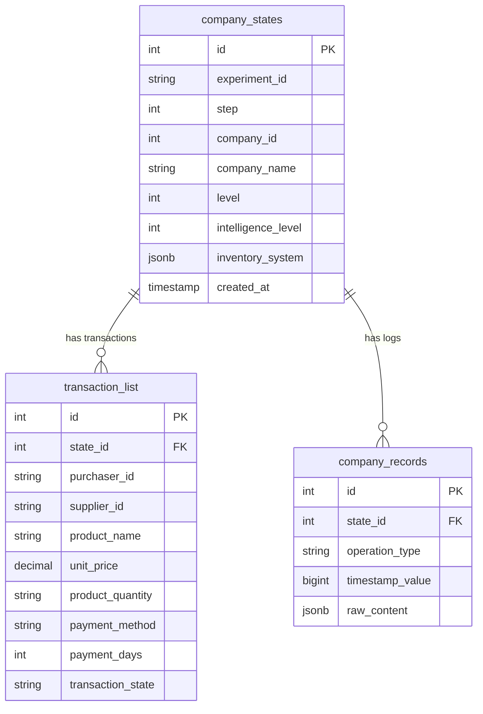
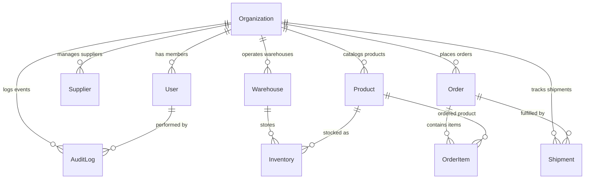

# Database Migration Plan: Supply Chain AI Platform

## 1. Existing Schema Analysis

The legacy codebase in `firmagentsql/` uses PostgreSQL primarily as an append-only time-series experiment logging store for agent simulations. It does not contain transactional SaaS business models (such as authenticated user accounts, multi-tenant organizations, purchasing workflows, or real-time warehouse inventory).

### Database Engine & Configuration
- **DBMS**: PostgreSQL 17 (via Docker container `postgresql-svc` or local host on port 5432)
- **Legacy Driver**: `psycopg` (v3 async connection)
- **Configuration**: Defined in `config.yaml` (`env.pgsql.dsn`) and loaded via `firmagentsql/config.py`.

---

## 2. Existing Tables

Based on `firmagentsql/insert.py` and `firmagentsql/select.py`, the existing tables are:

### Table 1: `company_states`
* **Purpose**: Captures the state of each firm agent at a specific simulation step in an experiment.
* **Columns**:
  - `id`: `SERIAL PRIMARY KEY`
  - `experiment_id`: `VARCHAR(100) NOT NULL` (Simulation run identifier)
  - `step`: `INTEGER NOT NULL` (Simulation tick / cycle)
  - `company_id`: `INTEGER NOT NULL` (Simulation internal company ID)
  - `company_name`: `VARCHAR(100) NOT NULL`
  - `level`: `INTEGER` (Supply chain tier level, e.g., 1, 2, 3)
  - `intelligence_level`: `INTEGER` (Agent LLM capability level, e.g., 1, 2, 3)
  - `inventory_system`: `JSONB` (Stores nested JSON of `{products: {...}, materials: {...}}`)
  - `created_at`: `TIMESTAMP DEFAULT CURRENT_TIMESTAMP`
* **Constraints**: `UNIQUE(experiment_id, step, company_id)`
* **Indexes**:
  - `idx_company_states_exp_step` on `(experiment_id, step)`
  - `idx_company_states_level` on `(level)`
  - `idx_company_states_intelligence` on `(intelligence_level)`
  - `idx_inventory_system_gin` GIN index on `(inventory_system)`

### Table 2: `transaction_list`
* **Purpose**: Records B2B transactions executed between firm agents during a simulation step.
* **Columns**:
  - `id`: `SERIAL PRIMARY KEY`
  - `state_id`: `INTEGER REFERENCES company_states(id) ON DELETE CASCADE`
  - `experiment_id`: `VARCHAR(100) NOT NULL`
  - `step`: `INTEGER NOT NULL`
  - `company_id`: `INTEGER NOT NULL`
  - `purchaser_id`: `VARCHAR(50)`
  - `supplier_id`: `VARCHAR(50)`
  - `product_name`: `VARCHAR(100)`
  - `unit_price`: `DECIMAL(10,2)`
  - `product_quantity`: `VARCHAR(50)` (Note: stored as string in legacy code)
  - `payment_method`: `VARCHAR(50)`
  - `payment_days`: `INTEGER`
  - `transaction_state`: `VARCHAR(50)`
  - `created_at`: `TIMESTAMP DEFAULT CURRENT_TIMESTAMP`
* **Indexes**:
  - `idx_transaction_list_exp_step` on `(experiment_id, step)`

### Table 3: `company_records`
* **Purpose**: Records internal events, LLM thoughts, communications, or operations generated by an agent.
* **Columns**:
  - `id`: `SERIAL PRIMARY KEY`
  - `state_id`: `INTEGER REFERENCES company_states(id) ON DELETE CASCADE`
  - `experiment_id`: `VARCHAR(100) NOT NULL`
  - `step`: `INTEGER NOT NULL`
  - `company_id`: `INTEGER NOT NULL`
  - `source_company_id`: `VARCHAR(50)`
  - `source_company_name`: `VARCHAR(100)`
  - `operation_type`: `VARCHAR(50)` (e.g., 'dialog', 'decision', 'trade')
  - `timestamp_value`: `BIGINT`
  - `raw_content`: `JSONB`
  - `created_at`: `TIMESTAMP DEFAULT CURRENT_TIMESTAMP`
* **Indexes**:
  - `idx_company_records_exp_step` on `(experiment_id, step)`
  - `idx_company_records_operation` on `(operation_type)`

---

## 3. Existing Relationships

* **Foreign Key**: `transaction_list.state_id` -> `company_states.id` (ON DELETE CASCADE)
* **Foreign Key**: `company_records.state_id` -> `company_states.id` (ON DELETE CASCADE)

---

## 4. Existing PostgreSQL Usage
- Used exclusively by `firmagentsql/` for:
  1. Storing time-step simulation outputs from batch experiments (`insert.py`).
  2. Aggregating experiment steps and companies for replay dashboards (`select.py`).
  3. Clustering company states and performance metrics (`enhanced_sql_clustering.py`).
- **Deficiencies in Legacy Design**:
  - Missing all SaaS concepts: no `users`, `organizations`, `roles`, or authentication tokens.
  - Denormalized schema: quantities are stored as strings (`product_quantity VARCHAR(50)`).
  - Unstructured inventories: inventory data is trapped inside a JSONB blob (`company_states.inventory_system`) without SKU IDs, warehouses, or constraints.
  - No tenant isolation: all data shares an unpartitioned namespace with no tenant ID.

---

## 5. Proposed Production Schema

The production schema addresses genuine SaaS supply-chain business requirements:
- Multi-tenancy via `organization_id` on all tenant-owned entities.
- Relational integrity with UUID primary keys and standard foreign keys.
- Clear separation between transactional business records (PostgreSQL) and graph topology (Neo4j).

### Proposed Production Tables

| Entity | Table Name | Key Columns | Business Requirement |
| :--- | :--- | :--- | :--- |
| **Organization** | `organizations` | `id (UUID)`, `name`, `slug (UNIQUE)`, `tier`, `created_at`, `updated_at` | SaaS multi-tenancy boundary |
| **User** | `users` | `id (UUID)`, `organization_id (FK)`, `email (UNIQUE)`, `hashed_password`, `role (ENUM)`, `is_active` | AuthN, RBAC, access control |
| **Supplier** | `suppliers` | `id (UUID)`, `organization_id (FK)`, `name`, `contact_email`, `tier (1,2,3)`, `rating`, `status` | Vendor management & procurement |
| **Warehouse** | `warehouses` | `id (UUID)`, `organization_id (FK)`, `code`, `name`, `address`, `capacity`, `current_utilization` | Storage facility operations |
| **Product** | `products` | `id (UUID)`, `organization_id (FK)`, `sku (UNIQUE per org)`, `name`, `unit_price`, `cost` | Item catalog & financial tracking |
| **Inventory** | `inventories` | `id (UUID)`, `organization_id (FK)`, `warehouse_id (FK)`, `product_id (FK)`, `quantity`, `safety_stock` | Real-time stock levels & reorder alerts |
| **Order** | `orders` | `id (UUID)`, `organization_id (FK)`, `supplier_id (FK)`, `order_number (UNIQUE)`, `status`, `total_amount` | Purchase orders & fulfillment |
| **OrderItem** | `order_items` | `id (UUID)`, `order_id (FK)`, `product_id (FK)`, `quantity`, `unit_price`, `total_price` | Line-item order breakdown |
| **Shipment** | `shipments` | `id (UUID)`, `organization_id (FK)`, `order_id (FK)`, `tracking_number`, `carrier`, `status`, `lat`, `lng` | In-transit tracking & logistics telemetry |
| **AuditLog** | `audit_logs` | `id (UUID)`, `organization_id (FK)`, `user_id (FK)`, `action`, `entity_type`, `entity_id`, `details` | Compliance, security auditing & change tracking |

---

## 6. Data Migration Risks & Mitigations

1. **Risk: Breaking Legacy Experiment Replay Dashboard**
   * *Detail*: The frontend `Replay` view and `firmagentsql/select.py` depend on `company_states` and `transaction_list`.
   * *Mitigation*: Do not drop or alter `company_states`, `transaction_list`, or `company_records`. The legacy simulation tables remain untouched alongside the new production tables.
2. **Risk: Quantity & Price Type Inconsistencies**
   * *Detail*: Legacy code stores `product_quantity` as `VARCHAR` and unit price as `DECIMAL`.
   * *Mitigation*: Production schemas enforce strict numeric types (`quantity INTEGER CHECK (quantity >= 0)`, `unit_price NUMERIC(12, 2)`).
3. **Risk: Cross-Tenant Data Leakage**
   * *Detail*: Accidental queries without `organization_id` filter would expose another tenant's data.
   * *Mitigation*: All repository query methods require `organization_id` parameter and apply an explicit `WHERE organization_id = :org_id` clause.

---

## 7. Tables That Should NOT Be Migrated to PostgreSQL Yet

1. **Multi-tier Supply Chain Graph**:
   * *Reason*: Supplier-to-supplier dependencies, BOM component structures, and graph traversals across tiers 1-3 belong in Neo4j as nodes and `[:SUPPLIES]` edges. Putting recursive graph relationships in PostgreSQL degrades query performance and complicates graph pathfinding.
2. **Raw MLflow Telemetry & Model Weights**:
   * *Reason*: Experiment run parameters, metrics curves, and model checkpoints are managed by MLflow's tracking server and SQLite/file store.
3. **GIS Road Network Topology**:
   * *Reason*: `beijing_map.pb` contains dense protobuf spatial network buffers for microscopic vehicle routing. Spatial graph structures are handled in-memory and mapped via graph coordinates.
