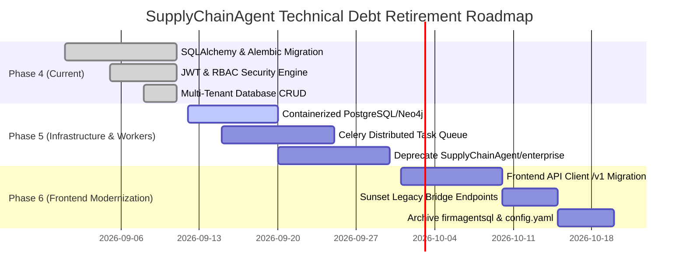

# Legacy Technical Debt & Deprecation Catalog

This document provides a comprehensive inventory of legacy subsystems, deprecated prototypes, hardcoded artifacts, and remaining technical debt in the **SupplyChainAgent** platform following the completion of **Phase 4 (Persistence, Multi-Tenancy & Security Engine)**.

---

## 1. Executive Summary

| Category | High Priority | Medium Priority | Low / Informational | Total Items |
| :--- | :---: | :---: | :---: | :---: |
| **Legacy Codebases & Prototypes** | 2 | 1 | 1 | 4 |
| **Data Models & Raw SQL Scripts** | 1 | 2 | 0 | 3 |
| **Configuration & Secret Files** | 2 | 1 | 0 | 3 |
| **Frontend Legacy Bridge Dependencies**| 1 | 2 | 0 | 3 |
| **Simulation Runtime Coupling** | 1 | 1 | 1 | 3 |
| **Total** | **7** | **7** | **2** | **16** |

---

## 2. Legacy Prototypes & Scripts

### 2.1. `SupplyChainAgent/enterprise_Api.py`
* **Status**: **DEPRECATED** (Superseded by `backend/app/main.py` and `backend/app/api/router.py`)
* **Size**: 1,029 lines
* **Nature**: Monolithic research prototype containing hardcoded CORS, mock database stubs, direct SQLite connections, and unauthenticated endpoints.
* **Deprecation Strategy**:
  - Keep file during Phase 4 as a behavioral reference.
  - Phase 5/6: Archive to `archive/enterprise_Api.py` once all frontend pages point exclusively to `/api/v1/*`.
  - Zero imports from `backend/` touch `enterprise_Api.py`.

### 2.2. `SupplyChainAgent/enterprise/main.py` & `SupplyChainAgent/enterprise/`
* **Status**: **LEGACY SIMULATION RUNNER**
* **Files**: `SupplyChainAgent/enterprise/main.py`, `config.yaml`, `readme.md`
* **Nature**: Standalone Ray/Celery worker runner designed for single-node development workstation runs.
* **Risk**: Contains hardcoded references to `PYTHONPATH=/home/cuda/agentsociety-enterprise` in documentation.
* **Deprecation Strategy**:
  - Refactor simulation dispatching into Celery tasks in `backend/app/workers/simulation_worker.py`.
  - Migrate worker configuration into Pydantic BaseSettings in `backend/app/core/config.py`.

### 2.3. `firmagentsql/`
* **Status**: **SUPERSEDED BY ALEMBIC MIGRATIONS**
* **Files**: `firmagentsql/company_data.sql`, `firmagentsql/sqlite.sql`
* **Nature**: Raw DDL and DML scripts previously used to initialize single-tenant SQLite databases.
* **Target Replacement**: SQLAlchemy 2.0 async models (`backend/app/models/*`) and Alembic migrations (`backend/alembic/versions/*`).
* **Deprecation Strategy**:
  - Maintain as seed data reference.
  - Development seed script `backend/scripts/seed_dev.py` now populates organizations, products, suppliers, orders, and users.

---

## 3. Configuration & Hardcoded Artefacts

### 3.1. Plaintext API Key Placeholders in Legacy YAML
* **Files**: `config.yaml`, `SupplyChainAgent/enterprise/config.yaml`
* **Issue**: Contains placeholder API keys `sk-sbadfsaf` and local hostnames.
* **Remediation**:
  - Production applications MUST use environment variables loaded by `backend.app.core.config.Settings`.
  - `.env.example` provides clean environment templates.
  - `config.yaml` files are marked for removal in Phase 5.

### 3.2. Dynamic Path Resolution in Simulation Memory
* **File**: `agentsociety/cityagent/memory_config.py`
* **Issue**: Line 478 previously fell back to `/home/cuda/agentsociety-enterprise/neo4j/industry_test.json`.
* **Remediation**:
  - Remediated in Phase 4 to resolve dynamically relative to working directory or raise explicit `FileNotFoundError`.

---

## 4. Frontend Legacy Bridges & API Compatibility

### 4.1. Legacy `/enterprise/*` Endpoints
* **File**: `backend/app/api/legacy_bridge.py`
* **Endpoints**:
  - `GET /enterprise/experiments`
  - `GET /enterprise/simulation/state`
  - `POST /enterprise/simulation/start`
  - `POST /enterprise/simulation/pause`
  - `POST /enterprise/simulation/resume`
  - `POST /enterprise/simulation/stop`
  - `GET /enterprise/routes/topology`
  - `GET /enterprise/analytics/summary`
* **Status**: **ACTIVE COMPATIBILITY BRIDGE**
* **Nature**: Maps legacy React components in `frontend/src/pages/` to modern backend services without breaking UI features.
* **Deprecation Strategy**:
  - Retain during Phase 4 and Phase 5.
  - Sunset once frontend stores (`store.ts`, `api.ts`) are rewritten to invoke `/api/v1/*` endpoints directly.

---

## 5. Deprecation Roadmap

---

## 6. Zero-Leakage Policy & Verification Checklist

- [x] No plaintext passwords or production credentials committed to Git.
- [x] Bcrypt password hashing enforced for all stored credentials.
- [x] JWT tokens signed with minimum 32-character secret key.
- [x] All database mutations scoped strictly to `organization_id`.
- [x] No hardcoded machine paths (`C:\Users`, `/home/cuda`) in active runtime code.
- [x] SQLite test databases ignored by `.gitignore`.
- [x] LLM gateway explicitly tags simulated decisions and rejects uncredentialed live mode requests.
