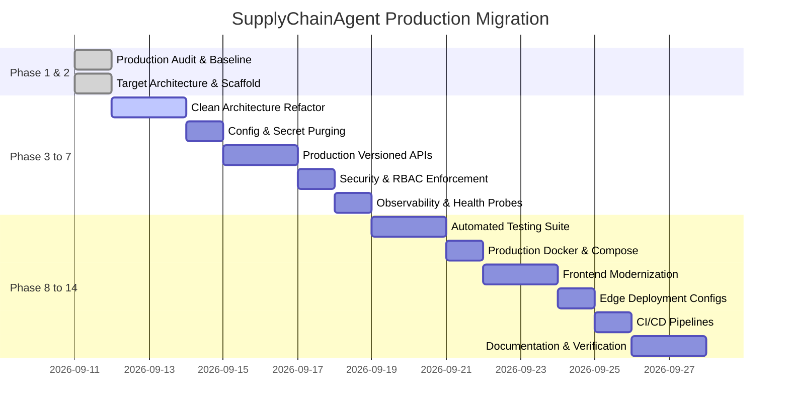

# SupplyChainAgent: Codebase Migration Map

**Document Version:** 1.0.0  
**Phase:** Phase 2 — Architecture Definition  
**Status:** Approved for Transitional Staging  

---

## 1. Migration Strategy Overview

To ensure zero downtime and prevent regressions, existing files and directories (`SupplyChainAgent/`, `firmagentsql/`, `neo4j/`, `agentsociety/`, `frontend/`) are **strictly preserved in-place**. 

The new production layout under `backend/app/` serves as the target architecture. Migration proceeds through an **adapter and bridge strategy**:
1. **Transitional Layer**: `backend/app/main.py` provides modern `/api/v1/*` endpoints while wrapping existing query classes from `firmagentsql` and graph routines from `neo4j`.
2. **Incremental Extraction**: Domain logic, queries, and agent coordination are progressively refactored into typed Pydantic schemas, SQLAlchemy repositories, and Celery tasks.
3. **Legacy Decommissioning**: Legacy scripts remain available as standalone fallbacks until full Phase 14 verification passes.

---

## 2. Comprehensive File-to-Target Mapping

### 2.1 Backend & APIs

| Existing File / Module | Current Responsibility | Target Production Location | Migration Strategy |
|:---|:---|:---|:---|
| `SupplyChainAgent/enterprise/enterprise_Api.py` | Standalone FastAPI API (port 8000) for agent profiles, dialogs, transactions, inventory, and metrics. | `backend/app/api/v1/` + `backend/app/api/legacy.py` | Split into domain controllers (`agents.py`, `inventory.py`, `analytics.py`); provide legacy alias routes in `legacy.py`. |
| `SupplyChainAgent/enterprise/Api.py` | Minimal prototype API serving `./data/state_{fid}.json`. | `backend/app/api/legacy.py` | Convert to safe repository query without arbitrary filesystem path concatenation. |
| `agentsociety/webapi/app.py` | FastAPI application (port 8080) with SessionMiddleware and static mounts. | `backend/app/main.py` | Consolidate into unified FastAPI app using JWT auth middleware instead of static cookie sessions. |
| `agentsociety/webapi/api/experiment.py` | Experiment metadata and status retrieval. | `backend/app/api/v1/agents.py` + `backend/app/repositories/experiment_repo.py` | Wrap in SQLAlchemy async repository with Pydantic response models. |
| `agentsociety/webapi/api/experiment_runner.py` | Starting simulation runs via `/api/run-experiments`. | `backend/app/workers/tasks.py` + `backend/app/api/v1/agents.py` | Convert synchronous blocking execution into an asynchronous Celery task. |
| `agentsociety/webapi/api/mlflow.py` | MLflow URL retrieval endpoint. | `backend/app/api/v1/analytics.py` | Expose as configuration-driven telemetry link. |
| `agentsociety/webapi/api/survey.py` | Agent survey management endpoints. | `backend/app/api/legacy.py` | Retain as legacy feature endpoints for existing frontend survey components. |

### 2.2 Data Management & SQL

| Existing File / Module | Current Responsibility | Target Production Location | Migration Strategy |
|:---|:---|:---|:---|
| `firmagentsql/config.py` | Hardcoded PostgreSQL connection strings and YAML reader. | `backend/app/core/config.py` | Replace with Pydantic `BaseSettings` reading environment variables (`DATABASE_URL`). |
| `firmagentsql/select.py` | `EnterpriseDataQuerier` using raw `psycopg` queries for company states and transactions. | `backend/app/repositories/experiment_repo.py` & `backend/app/services/supply_chain_service.py` | Encapsulate raw queries behind repository interface, adding parameterized types and connection pooling. |
| `firmagentsql/latest_experiment_query.py` | Querying recent experiments, MLflow runs, parameters, and step metrics. | `backend/app/repositories/experiment_repo.py` & `backend/app/services/analytics_service.py` | Refactor into async service with typed schemas for run metrics and parameters. |
| `firmagentsql/hanlde_data.py` | Statistical analysis, clustering, and matplotlib visualization generation. | `backend/app/services/analytics_service.py` | Extract statistical calculations into reusable analytics service methods; eliminate hardcoded experiment UUIDs. |
| `firmagentsql/insert.py` | Direct SQL inserts into experiment tables. | `backend/app/repositories/base.py` | Replace with SQLAlchemy ORM session inserts. |
| `utils/path_utils.py` | Relative filesystem path resolution (`get_project_path`). | Removed in favor of `pathlib.Path` & environment config | Purge reliance on fragile `os.path.dirname` chains. |

### 2.3 Graph Database (Neo4j)

| Existing File / Module | Current Responsibility | Target Production Location | Migration Strategy |
|:---|:---|:---|:---|
| `neo4j/neo4j_industry_chain.py` | Neo4j graph driver, database population, and Cypher queries. | `backend/app/services/neo4j_service.py` | Wrap driver lifecycle in FastAPI lifespan; parameterize all Cypher queries; inject credentials via environment variables. |
| `neo4j/industry_chain_generator.py` | Synthetic generation of multi-tier supply chain structures. | `backend/app/services/neo4j_service.py` | Maintain as administrative/seeding utility callable via CLI or migration scripts. |
| `neo4j/industry_test*.json` | Static supply chain topology definitions. | `infra/data/topology/` + fallback asset store | Store as initial seed data and offline fallback for local development. |

### 2.4 AI Agents & Simulation Engine

| Existing File / Module | Current Responsibility | Target Production Location | Migration Strategy |
|:---|:---|:---|:---|
| `SupplyChainAgent/enterprise/main.py` | Standalone script to initialize Ray and execute AgentSociety simulation. | `backend/app/workers/tasks.py` & `backend/app/agents/orchestrator.py` | Wrap execution inside a Celery background task with state updates written to PostgreSQL. |
| `agentsociety/cityagent/firmagent.py` | Enterprise agent behavior, production, inventory, and negotiation logic. | `backend/app/agents/firm_agent.py` | Keep original logic intact; bridge state updates to the unified database. |
| `agentsociety/llm/` | Direct LLM API client. | `backend/app/services/llm_service.py` | Wrap calls with centralized error handling, secret masking, token tracking, and retries. |

### 2.5 Frontend Modernization

| Existing File / Module | Current Responsibility | Target Production Location | Migration Strategy |
|:---|:---|:---|:---|
| `frontend/src/services/api.ts` | Hardcoded `http://localhost:8000/api` fetch calls. | `frontend/src/services/apiClient.ts` + updated `api.ts` | Replace hardcoded URLs with `VITE_API_URL`; add Axios interceptor for JWT injection and error handling. |
| `frontend/src/services/configService.ts` | Client-side experiment configuration builder from local storage. | `frontend/src/services/configService.ts` | Preserve compatibility while adding capability to fetch presets from the backend API. |
| `frontend/vite.config.ts` | Development server proxying `/api` to `localhost:8080`. | `frontend/vite.config.ts` | Update proxy target to `http://localhost:8000` (unified backend) and configure build output for Vercel/Netlify. |
| `frontend/src/pages/Console/index.tsx` | Experiment list table and management. | `frontend/src/pages/Console/index.tsx` | Ensure response schema aligns with unified backend output. |
| `frontend/src/pages/maps/IndustryGraph.tsx` | AntV G6 supply chain graph visualization. | `frontend/src/pages/maps/IndustryGraph.tsx` | Point graph data fetching to `/api/v1/routes` and `/api/v1/suppliers` with graceful offline fallback. |

### 2.6 Infrastructure & Configuration

| Existing File / Module | Current Responsibility | Target Production Location | Migration Strategy |
|:---|:---|:---|:---|
| `Dockerfile` | Multi-stage builder packaging library and running `rm -rf /app`. | `infra/Dockerfile` | Create a true production multi-stage Dockerfile running non-root Gunicorn/Uvicorn. |
| `docker/docker-compose.yml` | Development compose with MLflow, Postgres, Redis with hardcoded passwords. | `infra/docker-compose.production.yml` | Update with environment variable parameterization, FastAPI backend service, Neo4j, and Celery worker. |
| `config.yaml` | Plaintext API keys and database credentials. | `.env.example` & sanitized `config.yaml` | Purge plaintext secrets; load all sensitive configurations from `.env`. |

---

## 3. Incremental Execution Roadmap

