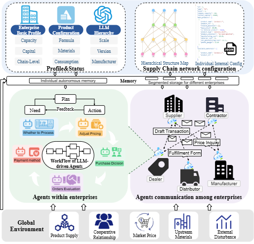

# 🌐 **SupplyChainAgent:  LLM-Driven Multi-Agent Simulation of Complex Supply Chains**

## 🧭 Overview

**SupplyChainAgent** is a
multi-agent supply chain simulation platform1 driven by large language
models (LLMs), .  
This project aims to onceptualize the supply chain as an ecosystem
of competing and cooperating enterprises

The repository integrates modular agent frameworks, data management systems, and visual analytics — providing a comprehensive platform for exploring how multi-agent cooperation can optimize industrial chain decisions.

---

## 🏗️ Project Structure
📦 Root Directory

├── agentsociety/ # Core agent modules and functional blocks  
│ ├── Enterprise Agents # Key enterprise intelligence and transaction modules  
│ └── Supporting Blocks # Shared agent logic and communication frameworks  
│  
├── firmagentsql/ # Database handling and experimental data analysis scripts  
│  
├── neo4j/ # Enterprise graph structure and Neo4j configuration scripts  
│  
├── frontend/ # Visualization front-end for real-time monitoring and analysis    
└── SupplyChainAgent/ # Main project entry point  

## Framework
 

### Framework Overview
* Multi-agent supply chain enterprise simulation platform built on AgentSociety v1.3
* Reconstructed enterprise information hierarchy, heterogeneous agent behavior logic, and platform lifecycle management
* Supports customizable agent-based analysis and decision-making for production and sales negotiations
* Integrates enterprise node knowledge graphs and data curves to evaluate strategy impact and agent-assisted capabilities

### Agent Initialization
* Per-enterprise configuration at startup:
  * Basic enterprise profile, product configuration, intelligence levels
  * Product details down to raw material composition, synthesis ratios, market averages, and profit shares
* Intelligence levels map to LLMs that empower agents during simulation
* Configuration is loaded into agents’ autonomous memory, forming the data foundation for collaborative production–sales decisions

### Supply Chain Topology & Propagation
* Enterprise hierarchy and material production–sales paths are configured across firms
* Cross-enterprise links arise from raw material requirements and product formulas
* Supply flows top-down; demand propagates bottom-up, forming a hierarchical graph
* Enables closed-loop interactions and sensitivity analysis of node-level changes on global dynamics

### Agent Workflows
* Internal operations: production and sales as the core
  * Capacity allocation, cost balancing (materials/processing/inventory), inventory management
  * Price estimation and negotiation target setting
* External operations: inquiries, negotiations, partner selection, order signing and fulfillment, delivery decisions
* Profit primarily from downstream sales while simultaneously procuring upstream and handling asynchronous requests

### Simulation Loop
* Round-based execution:
  * Decide whether to initiate production
  * Balance material, processing, and inventory costs with capacity
  * Set prices and negotiation benchmarks
  * Interact with upstream/downstream partners to evaluate requests, choose partners, confirm orders, and plan deliveries
* Manage physical product flows and capital flows end-to-end

### LLM-Driven Interactions
* LLM agents drive inter-enterprise inquiries, negotiations, and competitive cooperation
* Generate negotiation texts and execution instructions favoring enterprise objectives
* Leverage enterprise internal state and counterpart historical information
* Handle asynchronous procurement and supply requests, supporting continuous decision-making

### Data & Evaluation
* Enterprise knowledge graphs and data curves provide process monitoring and outcome validation
* Quantitative assessment of enterprise strategies and agent assistive performance
## ⚙️ Installation

### 1️⃣ Install Dependencies
In the project root directory:
```bash
pip install . -e
```
### 2️⃣ Set Up Environment Variables
Install python-dotenv and create an .env file in the root directory:
```bash
pip install python-dotenv
OPENAI_API_KEY=YOUR_API_KEY
```

## 🌐 Live Production Deployment

* **Production Frontend (Vercel)**: [https://frontend-pi-hazel-83.vercel.app](https://frontend-pi-hazel-83.vercel.app)
* **Production API (Render)**: [https://supplychain-backend-hc9p.onrender.com](https://supplychain-backend-hc9p.onrender.com)
* **Liveness Probe**: [https://supplychain-backend-hc9p.onrender.com/health/live](https://supplychain-backend-hc9p.onrender.com/health/live)
* **Status**: `DEPLOYED AND VALIDATED` (Managed PostgreSQL 16, Managed Redis, Neo4j certified fallback mode, and mock LLM deterministic simulation).

For full cloud architecture and operational runbooks, see [Phase 12 Finalization](docs/PHASE_12_PRODUCTION_FINALIZATION.md).

---

## 🚀 Running the Project Locally

### 1️⃣ Start the Modern Backend API
In the project root directory:
```bash
# Run database migrations
alembic -c backend/alembic.ini upgrade head

# Start FastAPI application
uvicorn backend.app.main:app --host 0.0.0.0 --port 8000 --reload
```
Interactive API documentation will be available at:
`http://localhost:8000/docs`

### 2️⃣ Start the Frontend Visualization
In the `frontend/` directory:
```bash
cd frontend
npm install
npm run dev
```
The React development dashboard will be available at:
`http://localhost:5173`

### 🐳 Self-Hosted / VPS Deployment Profile (Docker)
For self-hosted bare-metal or cloud VPS environments, the complete multi-container Docker infrastructure is preserved:
```bash
docker compose -f infra/docker-compose.production.yml up -d
```
See [Phase 8 Infrastructure Documentation](docs/PHASE_8_INFRASTRUCTURE.md) for self-hosted orchestration details.

## 📊 Key Features

### 🧩 Modular Multi-Agent Framework – Supports dynamic enterprise agent creation and role-based collaboration.

### 🔗 Graph-Based Industry Modeling – Built on Neo4j to represent real-world enterprise networks.

### 🧮 Data Analytics & SQL Integration – Streamlined data management and experiment tracking.

### 💬 Autonomous Decision-Making – Agents simulate negotiation, production, and transaction behaviors.

### 🌐 Interactive Visualization Dashboard – Observe and analyze supply chain evolution in real time.

## 🧰 Tech Stack
Backend: Python, FastAPI, AutoGen, SQLAlchemy, Neo4j

Frontend: React, Vite, Tailwind CSS

Containerization: Docker, Docker Compose

Data Management: SQLite / PostgreSQL, firmagentsql module

